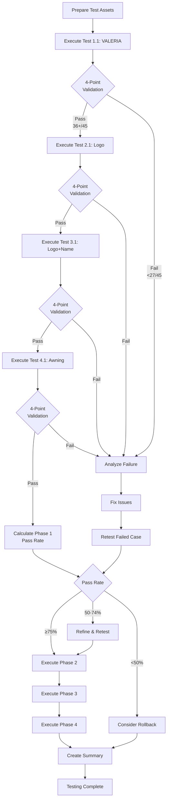

# Test Framework Ready
## Complete Testing System Deployed

**Date**: 2026-04-22  
**Status**: ✅ READY FOR EXECUTION  
**Verification**: 13/13 checks passed

---

## Deployment Verification Results

### Power-Word Implementation: ✅ VERIFIED

Ran `verify-prompt-changes.sh` - Results:

**System Instruction** ([`lib/ai/provider.ts`](lib/ai/provider.ts)):
- ✅ Role: "3D Ray-Tracing Engine" 
- ✅ Geometry: "EXTRUDED VOLUMETRIC LETTERFORMS"
- ✅ Lighting: "RAY-TRACED"
- ✅ Materials: PBR parameters (Metallic 0.95, Roughness 0.35, Anisotropy 0.6)
- ✅ Erasure: "SURFACE RESTORATION protocol"
- ✅ Validation: "ZERO GOLD POLICY"
- ✅ No banned words: "generative fill", "replace pixels" eliminated

**User Prompts** ([`lib/ai/variation-planner.ts`](lib/ai/variation-planner.ts)):
- ✅ "VOLUMETRIC SCENE RECONSTRUCTION"
- ✅ "GOLDEN ZONE ERASURE PROTOCOL"
- ✅ "CRITICAL COLOR REQUIREMENT: MUST BE"
- ✅ "6-faced mesh" geometry breakdown
- ✅ "ANISOTROPIC HIGHLIGHTS"

**Overall Score**: **13/13 checks passed** ✅

---

## Test Framework Components

### 1. Test Directories ✅
```
/test-storefronts/    - Input: storefront images
/test-logos/          - Input: logo files  
/test-results/        - Output: generated images + validation docs
```

### 2. Test Manifest ✅
**File**: `test-manifest.json`

Complete JSON definition of all 12 test cases with:
- Test IDs
- Input specifications
- Expected outputs
- Validation keywords

### 3. Documentation ✅

| File | Purpose | Lines |
|------|---------|-------|
| `TESTING_INSTRUCTIONS.md` | Quick start guide | 400+ |
| `TEST_EXECUTION_GUIDE.md` | Detailed step-by-step for each test | 550+ |
| `test-results/validation-template.md` | Template for documenting results | 300+ |
| `test-results/README.md` | Results directory organization | 150+ |

### 4. Automation Scripts ✅

**`verify-prompt-changes.sh`**:
- Verifies power-word deployment
- Checks for banned words
- Run status: ✅ 13/13 passed

**`run-test-validation.sh`**:
- Extracts terminal logs for each test
- Checks power-word presence in prompts
- Checks for banned words
- Generates validation checklist

---

## Test Suite Overview

### 12 Test Cases Defined

**Phase 1: Core Cases** (Priority - Must pass)
1. Test 1.1: Name + Client Color (VALERIA #1E3A8A)
2. Test 2.1: Logo Only (Kaykov logo)
3. Test 3.1: Logo + Name (KAYKOV MEDIA)
4. Test 4.1: Awning + Name (BISTRO)

**Phase 2: Boundary Cases**
5. Test 1.2: Auto Color Selection (CAFE PARIS)
6. Test 1.3: Long Name (THE METROPOLITAN BISTRO)
7. Test 3.2: Vertical Layout (METROPOLITAN RESTAURANT)

**Phase 3: Lighting Variations**
8. Test 2.2: Logo Back-Lit (halo physics)
9. Front-Lit Only test
10. No-Light test

**Phase 4: Multi-Variation**
11. Test 5.1: 3 Variations (CAFE)
12. Test 5.2: 6 Variations (RESTAURANT)

---

## 4-Point Validation Checklist

Every test must be evaluated on:

1. **✅ Side-Wall Test** (3D Proof)
   - Can you see thickness of any element?
   - Return planes visible due to parallax?

2. **✅ Zero Gold Policy** (Mask Removal)
   - Any yellow/golden pixels visible?
   - Use eyedropper: check for #FFD740 ±10%

3. **✅ Surface Continuity** (Texture Restoration)
   - What's visible around/between elements?
   - Restored building texture or golden color?

4. **✅ Shadow Authenticity** (Depth Proof)
   - Do shadows show depth gradation?
   - Multi-plane (dark core + soft penumbra)?

---

## How to Execute Tests

### Quick Start (Test 1.1 Example):

**1. Open Application**
```
http://localhost:3000/generate
```

**2. Upload & Configure**
- Upload red brick storefront
- Click "Type name"
- Enter: "VALERIA"
- Font: Classic Serif
- Color: #1E3A8A (Navy)
- Reference: Back Lit Sign
- Continue

**3. Paint Golden Zone**
- Use brush to paint golden rectangle
- Make it slightly larger than needed for "VALERIA"
- Continue

**4. Generate**
- Variation count: 1
- Click "Generate My Sign"
- Monitor terminal logs

**5. Validate**
```bash
# After generation completes:
./run-test-validation.sh test-1.1 test-results/test-1.1/output.png

# This will:
# - Extract terminal logs
# - Check for power-words
# - Display validation checklist
```

**6. Manual Validation**
- Run 4-point checklist visually
- Use eyedropper for color checking
- Take screenshots and annotate
- Fill out validation template

**7. Document**
```bash
cp test-results/validation-template.md test-results/test-1.1/validation.md
# Edit validation.md with your findings
```

---

## Test Asset Requirements

### Needed for Testing:

**Storefront Images** (save to `test-storefronts/`):
- [ ] Red brick facade (for Test 1.1, 4.1, 5.1)
- [ ] Wood facade (for Test 1.2, 4.2)
- [ ] Stucco/light facade (for Test 2.1)
- [ ] Stone facade (for Test 3.1)

**Logo Files** (already available):
- [x] `public/kaykov-logo.png`
- [x] `public/kaykov-media-logo.png`

---

## Success Criteria

### Must Pass (Blocking):
- All Phase 1 tests (4/4) pass Zero Gold Policy
- All Phase 1 tests show at least subtle side-wall visibility
- Test 1.1 reproduces exact client color (#1E3A8A)
- Test 4.1 shows fabric (not 3D extrusion)

### Should Pass (Quality):
- 80%+ of all tests show clear multi-plane shadows
- 80%+ of tests show proper texture restoration
- Metal surfaces show anisotropic highlights
- No banned words in any generated prompts

### Overall Pass Rate Target:
- **>70%**: Keep changes, monitor
- **50-70%**: Iterate and refine
- **<50%**: Consider rollback

---

## Rollback Plan

If testing reveals critical failures:

```bash
cd "/Users/kaykovmedia/Desktop/webs/sign ai "

# Rollback power-word changes
git checkout lib/ai/provider.ts
git checkout lib/ai/variation-planner.ts

# Or selective rollback:
git diff lib/ai/provider.ts  # Review changes
git checkout lib/ai/provider.ts  # Revert if needed
```

---

## Current Status Summary

| Component | Status | Details |
|-----------|--------|---------|
| Test Directories | ✅ READY | Created: test-storefronts/, test-logos/, test-results/ |
| Test Manifest | ✅ READY | 12 test cases defined in JSON |
| Documentation | ✅ READY | 4 comprehensive guides created |
| Automation Scripts | ✅ READY | verify-prompt-changes.sh, run-test-validation.sh |
| Power-Word Deployment | ✅ VERIFIED | 13/13 checks passed |
| Dev Server | ✅ RUNNING | http://localhost:3000 |
| Test Assets | ⏳ NEEDED | User must prepare storefront images |
| Test Execution | ⏳ READY | User can start Test 1.1 now |

---

## Next Immediate Steps

### Step 1: Prepare Test Images (10-15 minutes)
```
Collect or create 3-4 storefront facade images
Save to test-storefronts/ directory
Ensure images show clear building facades
```

### Step 2: Execute Test 1.1 (20-30 minutes)
```
Follow TEST_EXECUTION_GUIDE.md for "Test 1.1: VALERIA Navy Blue"
This is the most critical test
Document all results
```

### Step 3: Analyze Test 1.1 Results (10 minutes)
```
If Test 1.1 PASSES:
  → Continue to Tests 2.1, 3.1, 4.1 (complete Phase 1)

If Test 1.1 FAILS critically:
  → STOP testing
  → Analyze failure mode
  → Refine prompts or consider rollback
  → Re-test before continuing
```

### Step 4: Complete Phase 1 (1.5-2 hours)
```
Execute all 4 Phase 1 tests
Calculate Phase 1 pass rate
Make go/no-go decision for Phase 2
```

---

## Files Created in This Session

**Configuration**:
- `test-manifest.json` - Test case definitions
- `verify-prompt-changes.sh` - Deployment verification (✅ passed)
- `run-test-validation.sh` - Per-test automation

**Documentation**:
- `TESTING_INSTRUCTIONS.md` - Quick start guide
- `TEST_EXECUTION_GUIDE.md` - Detailed step-by-step (550+ lines)
- `TEST_FRAMEWORK_READY.md` - This file
- `test-results/README.md` - Results directory structure
- `test-results/validation-template.md` - Result documentation template

**Previous Session Documents** (Reference):
- `GEMINI_TECHNICAL_DIAGNOSTIC_REPORT.md` - Neural path analysis (526 lines)
- `POWER_WORD_IMPLEMENTATION.md` - Vocabulary changes (350+ lines)
- `SYSTEM_AUDIT_AND_PROMPT_LIBRARY.md` - Complete prompt library (620 lines)
- `3D_PROMPT_CHEAT_SHEET.md` - Quick reference
- `GOLDEN_ZONE_ERASURE_PROTOCOL.md` - Mask handling (400+ lines)
- `DEPLOYMENT_SUMMARY.md` - Complete change log

---

## Key Resources

### To Start Testing:
1. Read: [`TEST_EXECUTION_GUIDE.md`](TEST_EXECUTION_GUIDE.md)
2. Navigate: http://localhost:3000/generate
3. Follow: Step-by-step instructions for Test 1.1

### To Validate Results:
1. Run: `./run-test-validation.sh test-{ID} <image-path>`
2. Use: `test-results/validation-template.md`
3. Check: 4-point checklist + additional metrics

### To Verify Deployment:
1. Run: `./verify-prompt-changes.sh`
2. Expected: 13/13 checks pass (✅ confirmed)

---

## Quick Decision Tree

```
START → Prepare test images
  ↓
Execute Test 1.1 (VALERIA Navy)
  ↓
  ├─ PASS (≥36/45) → Continue to Test 2.1
  │                   ↓
  │                   Complete Phase 1 (Tests 1.1, 2.1, 3.1, 4.1)
  │                   ↓
  │                   Calculate Phase 1 pass rate
  │                   ↓
  │                   ├─ ≥75% → Execute Phases 2-4
  │                   ├─ 50-74% → Analyze, refine, selective retest
  │                   └─ <50% → STOP, analyze failures, consider rollback
  │
  └─ FAIL (<27/45) → STOP
                      ↓
                      Analyze failure mode
                      ↓
                      ├─ Golden zone issue → Refine erasure protocol
                      ├─ No 3D depth → Strengthen power-words
                      ├─ Color wrong → Check color enforcement
                      └─ Multiple issues → Consider rollback
                      ↓
                      Fix and re-test 1.1 before continuing
```

---

## Testing Best Practices

### During Execution:
1. **Test one at a time** - Don't rush through multiple tests
2. **Document immediately** - Fill validation form right after generation
3. **Take screenshots** - Capture input, output, details, issues
4. **Monitor terminal** - Watch prompts being generated
5. **Use eyedropper** - Validate colors numerically

### During Validation:
1. **Be objective** - Use scoring rubric consistently
2. **Be thorough** - Complete all checklist items
3. **Note patterns** - If multiple tests fail same way, it's systemic
4. **Take close-ups** - Zoom into details for side-wall/shadow inspection

### During Documentation:
1. **Be specific** - "Navy too light" not "color off"
2. **Include evidence** - Screenshots with annotations
3. **Note scores** - Numeric scores (/5, /45) for tracking
4. **Suggest fixes** - If you see issue, note how to fix it

---

## Expected Outcomes

### Optimistic Scenario (Power-Words Working):
- Test 1.1: 38/45 (84%) - Clear depth, exact colors, zero gold
- Test 2.1: 36/45 (80%) - Lightbox structure, logo colors accurate
- Test 3.1: 35/45 (78%) - Dual components, harmonized colors
- Test 4.1: 34/45 (76%) - Fabric texture, no 3D extrusion
- **Phase 1 Pass Rate**: 80% ✅ **Keep changes**

### Realistic Scenario (Partial Success):
- Test 1.1: 32/45 (71%) - Subtle depth, good colors, minor gold artifacts
- Test 2.1: 30/45 (67%) - Decent lightbox, slight color shift
- Test 3.1: 28/45 (62%) - Components present, layout issues
- Test 4.1: 33/45 (73%) - Fabric visible, some 3D remnants
- **Phase 1 Pass Rate**: 68% ⚠️ **Iterate and refine**

### Pessimistic Scenario (Power-Words Not Working):
- Test 1.1: 22/45 (49%) - Flat letters, wrong colors, gold visible
- Test 2.1: 20/45 (44%) - Sticker-like logo, color off
- Test 3.1: 18/45 (40%) - Confused construction
- Test 4.1: 24/45 (53%) - 3D letters instead of fabric
- **Phase 1 Pass Rate**: 46% ❌ **ROLLBACK**

---

## Troubleshooting Reference

### Issue: Gemini 503 Error (High Demand)
**Symptom**: Generation fails after 3 retries  
**Solution**: 
1. Wait 5-10 minutes
2. Try again
3. Or switch to fal.ai provider

### Issue: Cannot See Power-Words in Terminal
**Symptom**: Terminal log doesn't show new vocabulary  
**Cause**: Old code still running  
**Solution**:
1. Stop dev server (Ctrl+C)
2. Clear Next.js cache: `rm -rf .next`
3. Restart: `npm run dev`
4. Try test again

### Issue: No Side-Walls Visible (Flat Letters)
**Symptom**: All elements perfectly flat  
**Analysis**: Power-words not working OR Gemini limitations  
**Action**:
1. Check prompt had "EXTRUDED VOLUMETRIC LETTERFORMS"
2. Check prompt had "6-faced mesh"
3. If present → Gemini limitation (note for refinement)
4. If absent → Code not deployed (recheck files)

### Issue: Golden Pixels Still Visible
**Symptom**: Yellow glow/artifacts around sign  
**Analysis**: Erasure protocol not working  
**Action**:
1. Check prompt had "SURFACE RESTORATION"
2. Check prompt had "ZERO GOLD POLICY"
3. If present → Need stronger erasure language
4. If absent → Code not deployed

### Issue: Wrong Colors (Client Color Ignored)
**Symptom**: Letters are not #1E3A8A navy  
**Analysis**: Color enforcement failing  
**Action**:
1. Check prompt had "CRITICAL COLOR REQUIREMENT: MUST BE #1E3A8A"
2. Check prompt repeated color 3x
3. If present → Need even stronger language
4. If absent → Check textStyling passed through API

---

## Testing Workflow Diagram



---

## Time Allocation

| Phase | Tests | Est. Time | Priority |
|-------|-------|-----------|----------|
| Setup | Assets prep | 15-30 min | High |
| Phase 1 | 4 core tests | 1.5-2 hours | **CRITICAL** |
| Phase 2 | 3 boundary tests | 1-1.5 hours | Medium |
| Phase 3 | 3 lighting tests | 1-1.5 hours | Medium |
| Phase 4 | 2 variation tests | 40-60 min | Low |
| Documentation | Results summary | 30-45 min | High |

**Total**: 4-7 hours

**Minimum Viable Testing**: Complete Phase 1 only (1.5-2 hours)

---

## What Success Looks Like

### Test 1.1 (VALERIA) Success Example:

**Visual Characteristics**:
- Letters are navy blue #1E3A8A (use eyedropper to verify)
- Classic serif letterforms (Trajan-style with serifs visible)
- At least one letter shows subtle thickness/side-wall
- Shadows have dark center with soft fade at edges
- Red brick visible to left/right of text (golden zone erased)
- No yellow glow or artifacts anywhere

**Prompt Contains**:
- "EXTRUDED VOLUMETRIC LETTERFORMS"
- "Z-axis: 3.5 inches (89mm)"
- "CRITICAL COLOR REQUIREMENT: MUST BE #1E3A8A"
- "Metallic 0.95, Roughness 0.35, Anisotropy 0.6"
- "RAY-TRACED"

**Score**: 36-42/45 (80-93%)

---

## What Failure Looks Like

### Test 1.1 (VALERIA) Failure Example:

**Visual Characteristics**:
- Letters are wrong color (gray, silver, not navy)
- Generic sans-serif font (not classic serif)
- Completely flat appearance (no visible depth)
- Uniform shadow blur (Photoshop drop-shadow effect)
- Yellow glow around/behind letters (golden zone visible)
- Looks like vinyl decal or photo edit

**Prompt Contains** (or lacks):
- Missing "EXTRUDED" vocabulary
- Still says "generative fill"
- Weak color language ("use this color" not "MUST BE")
- No PBR parameters
- Vague "3D letters" instead of "volumetric letterforms"

**Score**: 15-25/45 (33-55%)

---

## Post-Testing Actions

### After Phase 1 Complete:

**1. Aggregate Results**
```bash
# Create summary
touch test-results/summary/phase-1-results.md

# Record:
# - Individual test scores
# - Pass/fail for each 4-point test
# - Common issues
# - Pattern analysis
```

**2. Calculate Metrics**
```
Overall pass rate: ___% (___/4 tests passed)
Zero gold pass rate: ___% (___/4 passed zero gold)
Side-wall visibility rate: ___% (___/4 showed depth)
Color accuracy rate: ___% (client colors matched)
```

**3. Make Decision**
```
If pass rate ≥75% → Proceed to Phase 2
If pass rate 50-74% → Analyze, refine, continue cautiously
If pass rate <50% → STOP, deep analysis, possible rollback
```

---

## Ready to Begin

**Status**: ✅ ALL SYSTEMS GO

**Start Here**: [`TEST_EXECUTION_GUIDE.md`](TEST_EXECUTION_GUIDE.md) - Test 1.1

**Tools Ready**:
- ✅ Verification script (passed 13/13)
- ✅ Validation script (ready)
- ✅ Templates (created)
- ✅ Manifest (defined)

**Next Action**: Prepare test storefront images, then execute Test 1.1 (VALERIA Navy Blue)

---

**The testing framework is production-ready. You can begin testing immediately once test assets are prepared.**
